# Solar AI
## Solar Power Plant Monitoring System using Local LLM

<div align="center">

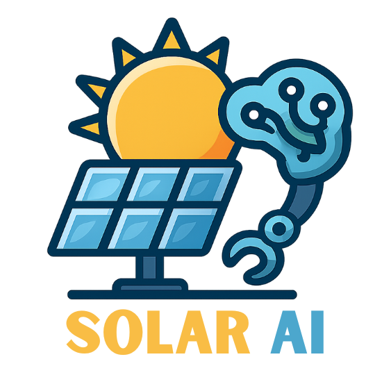

</div>

<!-- Badges -->
<div align="center">


### Core Technologies


### Key Features


### Advanced Features


</div>

## Overview

Solar AI is an advanced web-based simulation and monitoring system for solar power plants, specifically designed for the Rajasthan region. This application combines real-time solar generation calculations, equipment health monitoring, environmental factor simulation, and AI-powered analytics to provide comprehensive plant management capabilities.

## Screenshots

### Main Interface & Dashboard

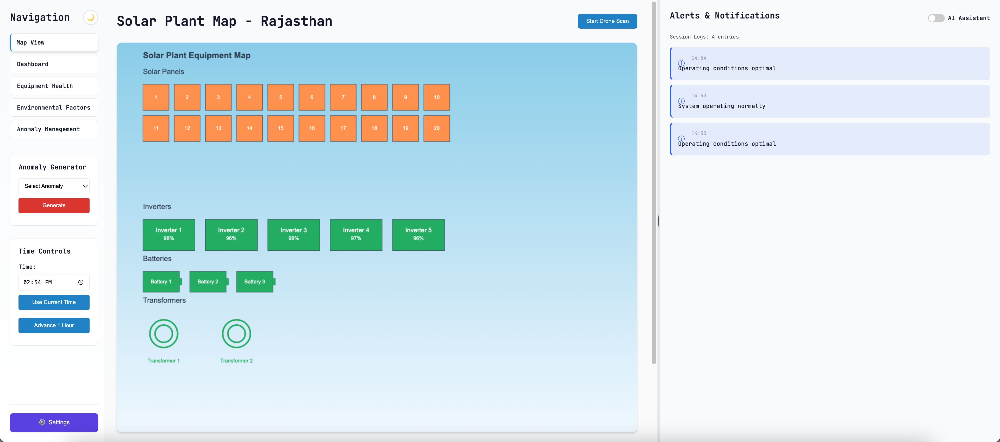
*Interactive solar map showing the plant layout with real-time equipment status visualization*

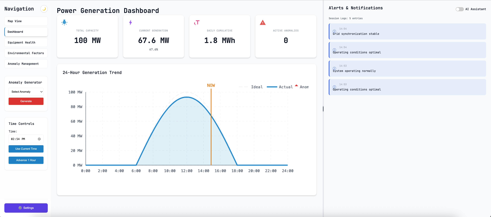
*Real-time power generation metrics with ideal vs actual comparison charts*

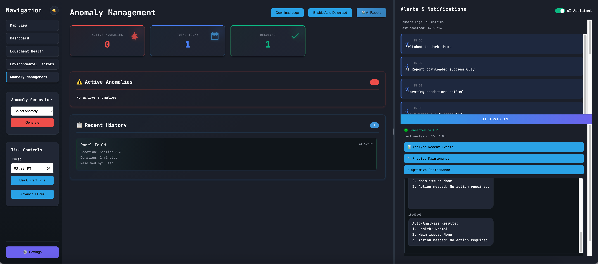
*Professional dark theme with glass-morphism effects for reduced eye strain*

### Equipment & Environmental Monitoring

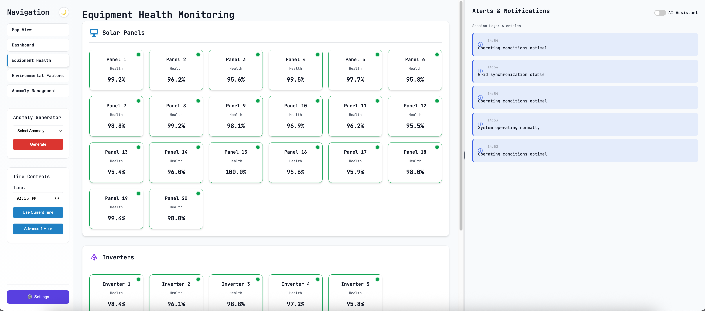
*Comprehensive equipment health status for panels, inverters, batteries, and transformers*

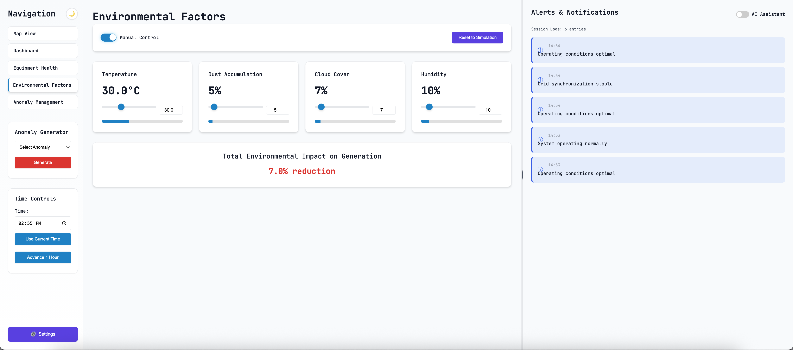
*Environmental control panel for temperature, dust, cloud cover, and humidity management*

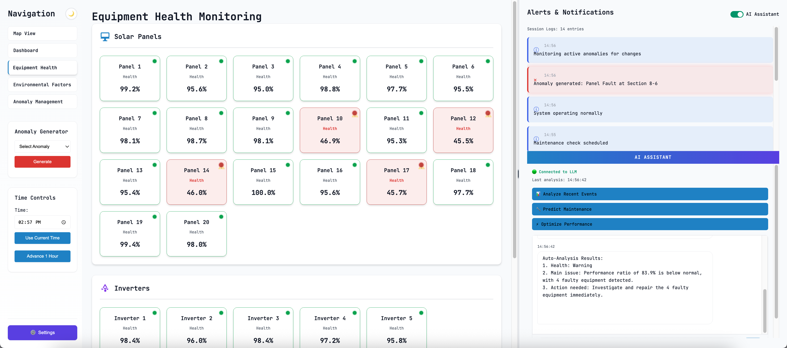
*Visual indication of equipment faults on the solar map*

### Anomaly Management & Operations

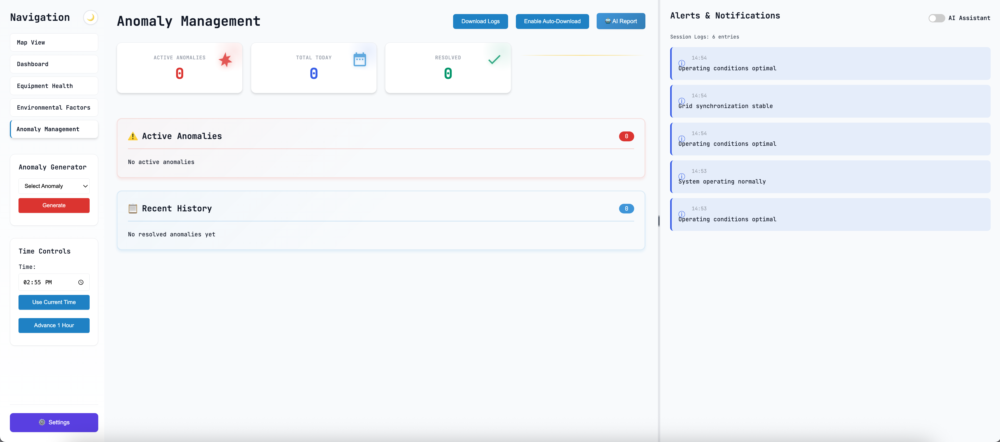
*Active anomaly tracking with resolution options and escalation levels*

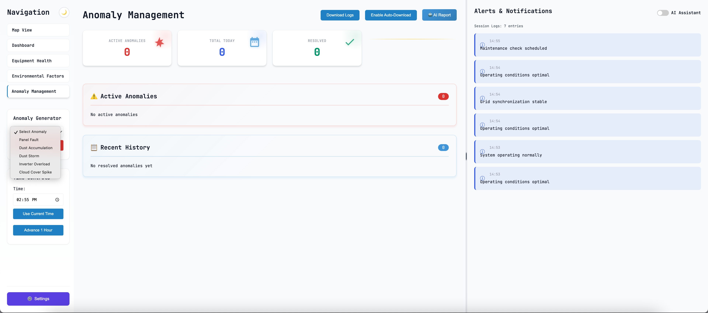
*Manual anomaly generation for testing and simulation purposes*

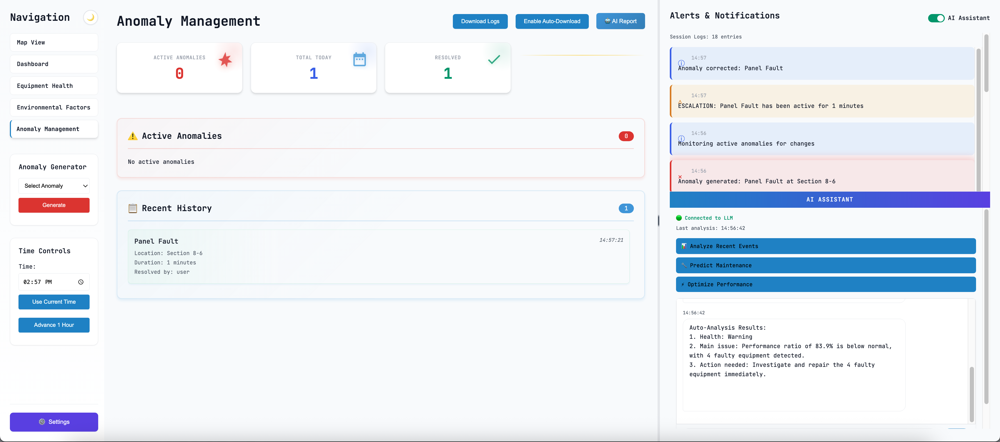
*Historical record of resolved anomalies with timestamps and details*

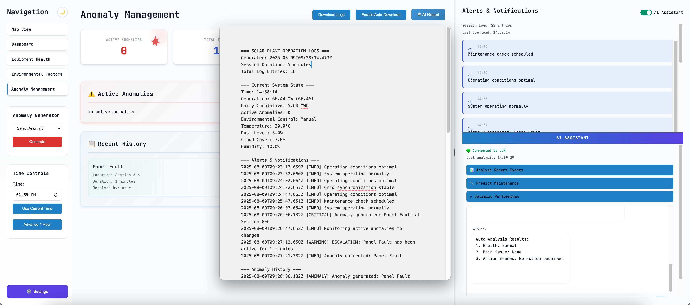
*Comprehensive system logs with categorized events and download options*

### AI-Powered Features & Configuration

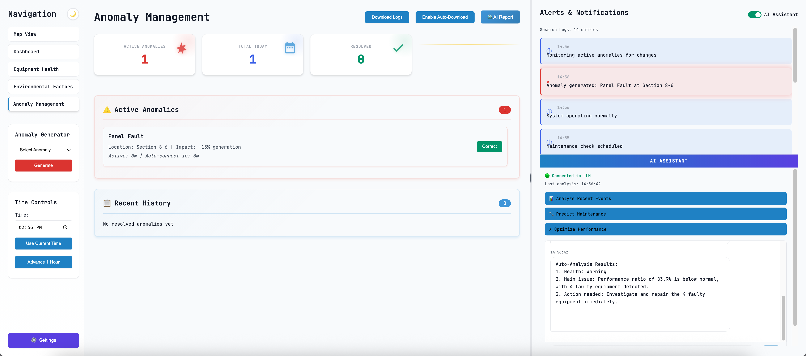
*Natural language chat interface for intelligent plant analysis and queries*

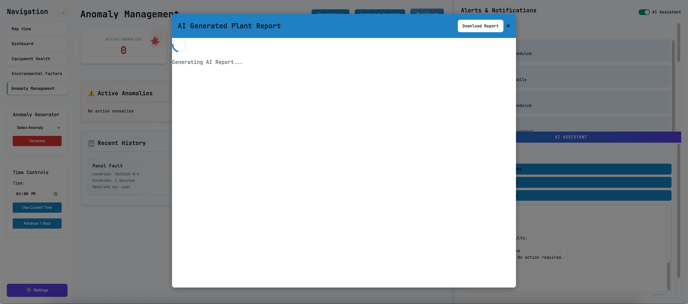
*AI-powered comprehensive plant analysis report generation interface*

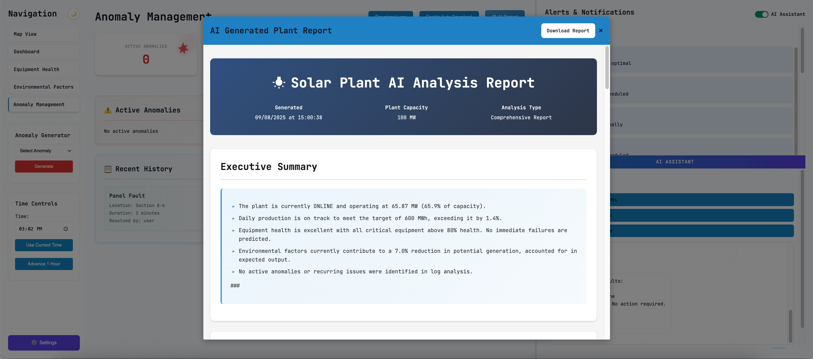
*Professional HTML report with detailed analysis, recommendations, and predictions*

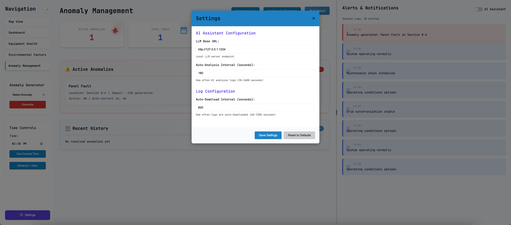
*Configuration panel for LLM endpoint, analysis intervals, and system preferences*

## Key Features

### 🌞 Real-Time Solar Generation Simulation
- Accurate daylight hour calculations (6 AM - 6 PM)
- Environmental factor impact modeling (temperature, dust, cloud cover, humidity)
- Dynamic generation curves with ideal vs actual comparison

### 🔧 Equipment Health Monitoring
- 20 solar panels with individual health tracking
- 5 inverters, 3 battery banks, and 2 transformers
- Automatic anomaly detection for equipment below 80% health
- Gradual equipment degradation simulation

### 🌪️ Environmental Anomaly Management
- Equipment anomalies: Panel faults, dust accumulation, inverter overload
- Environmental anomalies: Dust storms, cloud cover spikes
- Escalation system with auto-correction after 200 seconds
- Cascade effects (dust storms trigger panel dust accumulation)

### 🤖 AI-Powered Analytics
- Local LLM integration for intelligent analysis
- Auto-analysis at configurable intervals
- Natural language chat interface
- Comprehensive report generation with 7 analysis sections
- Performance predictions and maintenance planning

### 📊 Advanced Dashboard
- Interactive solar map with responsive Canvas visualization
- Real-time metrics and generation charts
- Dual theme support (dark/light modes)
- Professional UI with glass-morphism effects
- Resizable alert panel with drag handle

### 📝 Comprehensive Logging System
- Session event tracking with severity levels
- Auto-download capability at configurable intervals
- Categorized log exports with system state snapshots
- AI conversation history included in exports

### 🚁 Drone Inspection Simulation
- Systematic panel scanning
- Dust level and health assessment
- Automated recommendation generation

## Technology Stack

- **Frontend**: Pure HTML5, CSS3, JavaScript (ES6+)
- **Architecture**: Single-page application with view switching
- **Styling**: CSS variables for dual-theme support
- **Fonts**: JetBrains Mono for professional typography
- **AI Integration**: Local LLM support (configurable endpoint)
- **Storage**: LocalStorage for settings and preferences
- **No Dependencies**: Runs entirely in browser, no build process required

## Quick Start

1. **Clone the repository**
   ```bash
   git clone [repository-url]
   cd Solar-AI-Demo
   ```

2. **Open the application**
   - Simply open `index.html` in a modern web browser
   - No installation, compilation, or server setup required

3. **Optional: Set up AI Assistant**
   - Install a local LLM server (e.g., LM Studio, Ollama)
   - Configure the endpoint in Settings (default: http://127.0.0.1:1234)
   - Enable auto-analysis for intelligent monitoring

## System Requirements

- Modern web browser with ES6+ support
- Canvas API support for visualizations
- Optional: Local LLM server for AI features
- Recommended: 1920x1080 or higher resolution display

## Configuration

Access the Settings modal from the sidebar to configure:
- **LLM Base URL**: Endpoint for AI assistant
- **AI Analysis Interval**: 30-3600 seconds
- **Log Download Interval**: 60-7200 seconds

All settings persist in browser localStorage.

## Key Components

### Views
- **Solar Map**: Interactive plant layout with equipment status
- **Dashboard**: Real-time metrics and generation charts
- **Equipment Health**: Detailed equipment status monitoring
- **Environmental Control**: Manual/automatic factor adjustment
- **Anomaly Management**: Active anomaly tracking and resolution

### Time Simulation
- Real-time mode with system clock
- Simulation mode with custom time setting
- "Advance 1 Hour" for quick progression
- Automatic midnight detection and daily reset

### AI Features
- **Quick Actions**: Analyze Events, Predict Maintenance, Optimize Performance
- **Chat Interface**: Natural language queries about plant status
- **Report Generation**: On-demand comprehensive analysis reports
- **Auto-Analysis**: Periodic system health checks

## Project Structure

```
Solar-AI-Demo/
├── index.html           # Main application structure
├── styles.css          # Comprehensive styling with theme support
├── script.js           # Core application logic and state management
├── ai-assistant.js     # AI Assistant integration module
└── README.md           # This file
```

## Features in Detail

### Anomaly System
- **Equipment Anomalies**: Can be manually corrected
- **Environmental Anomalies**: Must wait for auto-resolution
- **Escalation Levels**: Increase every 60 seconds
- **Cascade Effects**: Dust storms create residual panel dust

### Environmental Factors
- **Temperature**: Affects panel efficiency
- **Dust Level**: Reduces generation capacity
- **Cloud Cover**: Blocks solar radiation
- **Humidity**: Minor efficiency impact

### Logging Capabilities
- Comprehensive event tracking
- Severity-based categorization
- System state snapshots
- AI conversation history
- Auto-download with timestamps

## Browser Compatibility

- Chrome 90+
- Firefox 88+
- Safari 14+
- Edge 90+

## License

MIT License

Copyright (c) 2025 Varun Nidhi

Permission is hereby granted, free of charge, to any person obtaining a copy
of this software and associated documentation files (the "Software"), to deal
in the Software without restriction, including without limitation the rights
to use, copy, modify, merge, publish, distribute, sublicense, and/or sell
copies of the Software, and to permit persons to whom the Software is
furnished to do so, subject to the following conditions:

The above copyright notice and this permission notice shall be included in all
copies or substantial portions of the Software.

THE SOFTWARE IS PROVIDED "AS IS", WITHOUT WARRANTY OF ANY KIND, EXPRESS OR
IMPLIED, INCLUDING BUT NOT LIMITED TO THE WARRANTIES OF MERCHANTABILITY,
FITNESS FOR A PARTICULAR PURPOSE AND NONINFRINGEMENT. IN NO EVENT SHALL THE
AUTHORS OR COPYRIGHT HOLDERS BE LIABLE FOR ANY CLAIM, DAMAGES OR OTHER
LIABILITY, WHETHER IN AN ACTION OF CONTRACT, TORT OR OTHERWISE, ARISING FROM,
OUT OF OR IN CONNECTION WITH THE SOFTWARE OR THE USE OR OTHER DEALINGS IN THE
SOFTWARE.

## Support

For technical support or inquiries about this demonstration system, please contact the development team through authorized channels.

## Acknowledgments

Developed as a demonstration of advanced solar plant monitoring capabilities with AI integration for the Rajasthan region solar energy sector.

---

*Note: This is a demonstration system. For production deployments, additional security, scalability, and reliability features would be required.*
